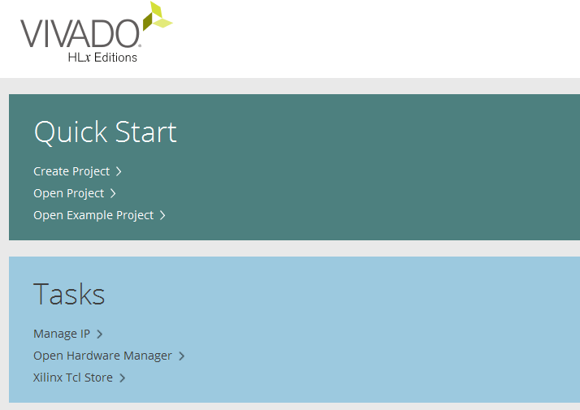
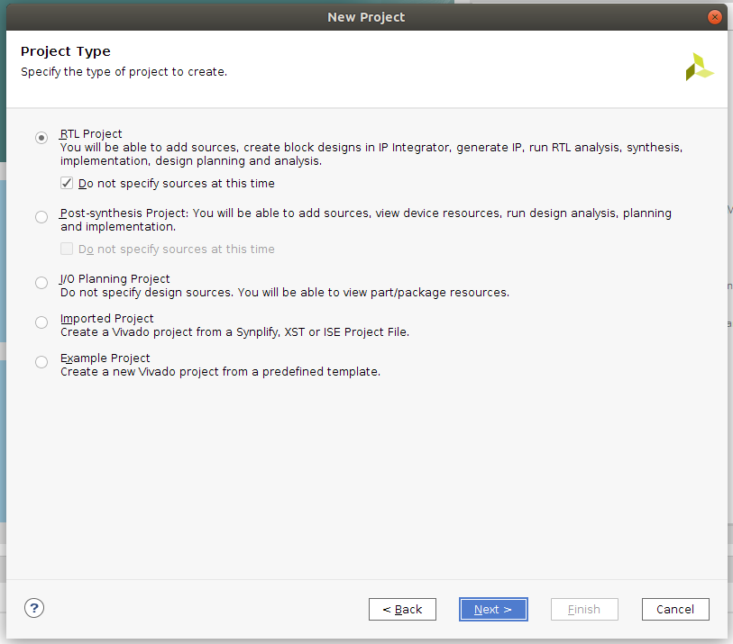
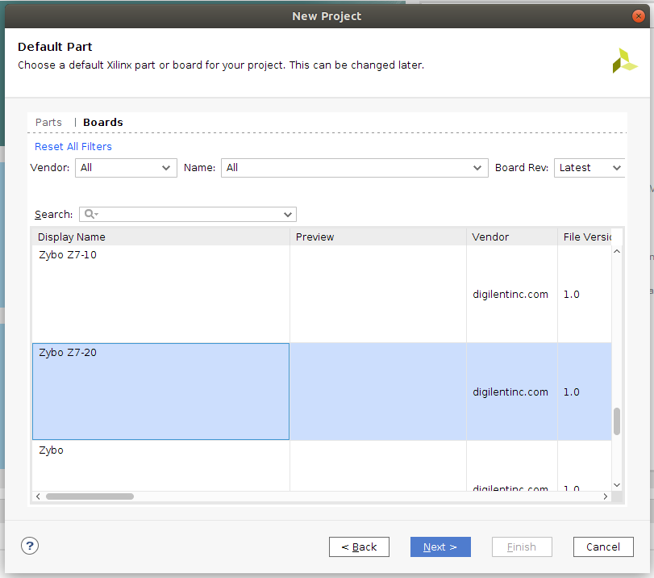
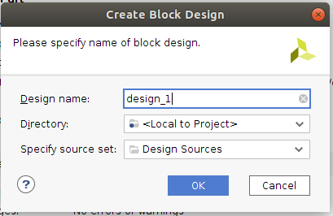
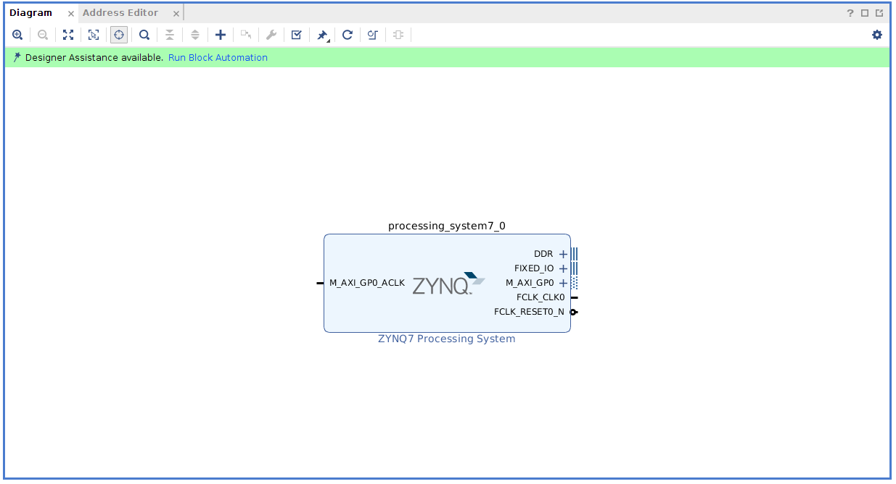
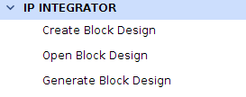
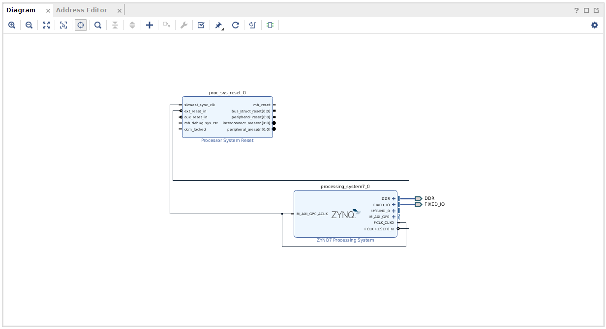

<p align="center"> 

</p>

### **ES3F1 Lab 1**

Lab 1 is an introduction to Xilinx's Zynq SoC Architecture using the Digilent Zybo Z7-20 series FPGA boards. We'll walk through setting up the processing system in hardware, exporting this from Vivado to the Xilinx SDK environment and writing some software in C to run on one of the ARM cores.

### **Getting Started**

If you have not set up a project/hardware design from Vivado and exported it to the SDK, start with the [Vivado Guide](rtl/README.md) to generinclude in header htmlate a bitstream. Once this has generated follow the guide to the [Sinclude in header htmlDK Guide](src/README.md) to complete the steps for compiling and rinclude in header htmlunning software on the Zynq.
include in header html
### Xilinx Vivado Sinclude in header htmletup
include in header html
Created an HDL project in Xilinx Vivado to instantiate the Processing Unit and the Programable Logic Region.

#### Vivado

1. Open Xilinx Vivado 2018.3 (whichever version is available in the lab)
2. Create an new Vivado Project

   

   1. Select **RTL Project** and **Do not specify sources at this time** and press **Next**

      

   2. Click on the **Boards** tab and scroll to find the **Zybo Z7-20**. Click **Next**. If you cannot see the board please follow [installing boards](#Installing-Boards).

      

   3. Accept these options by pressing **Finish**

3. Create empty block design inside the new project
   1. Add the **ZYNQ7 Processing System** IP core and the **Processor System Reset** IP Core. Connect the *slowest_sync_clk* to the *M_AXI_GP0_ACLK* and the *FCLK_CLK0*. Also ensure that the *ext_reset_in* is connected to *FCLK_RESET0_N*. Run the **Block Automation**, accepting the default settings.

      

      - We do not need to add any additional cores as we are only using the processing system in this lab. In future labs we will look at how to communicate between the PS and PL.

      

   2. Validate, save and generate the block design

      

   3. Create an HDL system wrapper (Right click on the block diagram, which will be called "design_1.bd" if you didn't rename it, under **Sources->Design Sources**)

      

   4. Run Synthesis and Implementation to generate the netlist and floor planning

   5. You will now be prompted to generate Bitstream file, accept this option.
   6. Export Hardware Design (**File->Export->Export Hardware**) including the generated bitstream file to SDK tool
   7. Launch SDK (**File->Launch SDK**)

You are now ready to start an [SDK software project](#Xilinx-SDK-Setup) for the Digilent Zybo Z7-20.

#### Installing Boards (optional)

**If required**, you may need to install board files in order to support the Zybo Z7 FPGA board. The board files folder can be found here: `C:\Xilinx\Vivado\2018.3\data\boards` (Change the version for your specific version of Vivado). By default this folder contains XML files for different FPGA boards manufactured by Xilinx.

XML files define different interfaces on the board. Interfaces such as Slide Switches, Push Buttons, LEDs, USB-UART, DDR Memory, Ethernet etc.

Download and extract this Zip file from Digilent: https://github.com/Digilent/vivado-boards/archive/master.zip
You can also check out the repository for the board files on github located here

This zip file will contain a folder called new/board_files. Save this in your user documents folder. We will copy this board_files folder, navigate to the board_files folder inside the Vivado Installation directory, and merge them both.

1. Copy the contents of the board_files folder

2. Navigate to the board_files folder in the Vivado Installation directory (`C:\Xilinx\Vivado\2019.3\data\boards\board_files`)

3. Paste the contents into the board_files folder

4. Restart Vivado

The newly added files will each contain a sub-folder for the current board revision. This sub-folder contains the respective XML files for each FPGA board.

### Xilinx SDK Setup

Once you've exported your bitstream from Vivado and selected the "Launch SDK" option ("File"->"Launch SDK"), you'll need to create a new C/C++ project (we'll be working C for this lab).

#### Application Project

1. Create a new **Application Project** ("File"->"New"->"Application Project").
   1. Give your project a name.
   2. Select **standalone** as the OS Platform (We won't be using an OS for this lab).
   3. Ensure that the hardware wrapper is the bitstream that you exported earlier from Vivado (should be something like **base_zynq_wrapper_hw_platform_0**).
   4. Select the **ps7_cortexa9_0** processor (the Zynq 7020 is dual core but we only need one core for now)
   5. Choose **C** as your language.
   6. Select **Create New** for the Board Support Package (this file defines the peripherals available to the PS).
2. Select the template for **Hello World**, we'll use this as a boilerplate for configuring additional headers, etc. Press **Finish** and this will generate a new project along side the hardware wrapper. 
3. For convention, rename **helloworld.c** to **main.c** (this isn't essential but it makes it clear where the entry point of the program is located)
4. Either copy or replace the code from [template.c](src/template.c) into the main.c file within the Xilinx SDK. Use this as a starting point to begin writing your program.
5. Ensure that the Zybo Z7 is plugged into the host PC (via the USB UART port) and that the jumper JP5 is set to JTAG. To program the FPGA (PL), click the **Program FPGA** button on the tool bar.
   1. Accept the default settings by pressing **Program**
   2. The Zybo Z7 board will illuminate the **Done** LED when it has finished programming.
6. Now we need to program the PS. Do this by **right clicking the code source of the project** (it will be named the same as the project name from section 1.1).
   1. Select **run as -> Launch on Hardware (System Debugger)**.
7. In the bottom of the SDK Window, there should be a tab named **SDK Terminal**. If your board is connected correctly, you'll be able to click the **green +** button to add a new serial connection.
   1. Under port, select your device's port (if using windows this will be **COM #**).
   2. The remainder of the settings should be as follows:
      - Data Bits: 8
      - Stop Bits: 1
      - Flow Control: None
      - Timeout (sec): *leave blank*
8. You should now have a serial connection open with the board and be able to see it receiving `xil_printf()` information from your application.


### **Objectives**

Successfully export a basic Processing System layer in hardware to the SDK in order to write a C program that computes the multiplication of two square matrices and returns the solution + the time taken for program execution.

Follow the set up example in the rtl instructions, moving onto the src instructions when you've successfully exported the hardware bitstream.

To get started with a project in the Xilinx SDK, you may use the [template.c](src/template.c) as a starting point.

1. Create an instance of a timer at the entry point of your program, using the "xtime_l.h" library. We'll use this later to time our multiplication function. The example below shows you how to set up an instance of the timer and how to use the `XTime_GetTime()` function.

```C
#include "xtime_l.h"
#include "xil_printf.h"

void example(){

   XTime tVariable;

   XTime_GetTime(&tVariable);

   xil_printf("%lld", tVariable);

}
```

- Hint: Think about how to measure a time interval. You will need to take a reading before and after the event, to find the difference. XTime is an unsigned 64 bit data type.

2. Create a C function that takes a int pointer to a pointer and initialises each of the elements in the passed 2D array (**which represents a matrix**) with a random integer using the `rand()` function. Make sure to allocate memory for each 2D array (both rows and columns!). Don't forget to seed your `rand()` function with `srand(YOUR_SEED_VALUE)` to ensure that you don't get the same results each time the program runs.

- **Hint: Ideally, you want YOUR_SEED_VALUE to be a different number each time you start your application.**

3. Format and print your random matrices to the serial console so you can check the input values against your output matrix later on. 

- Hint: Use loop (or possibly multiple loops) along with `xil_printf("%d", tVariable);` to increment through the rows and columns of your matrix

3. Allow for a macro to set the size of the input 2D array (i.e. `#define SIZE`). We'll use this to see the effect on matrix size against the required clock cycles for computation.

4. Write a function that takes 3 array pointers and multiplies the first two together, storing the result in the 3rd. 

5. Use the timer from step 1. to sample the time before and after the multiplication and calculate the time taken for the computation.

6. Format and print your output solution matrix to the serial console. Do this outside of your timer so as not to affect the timing operation.

7. Don't forget to deallocate memory and run `cleanup_platform()` at the end of your program to release any used instances from memory.

Note - You can print data to the serial terminal (within the Xilinx SDK) using the "xil_printf.h" library. This function however does not support floating point values, so you will need to use printf() from the <stdio.h> library with standard "%f" formatting, instead.

### **Extra**

1. Modify your function to handle 2D arrays that contain floats, how does this affect the computation time? 

2. Think about how we might do this multiplication on an FPGA? Could we offload the multiplication from the processing system to the FPGA to improve performance? What are the constraints with working with floating point numbers on an FPGA? 
