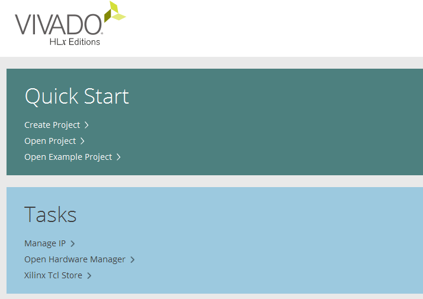
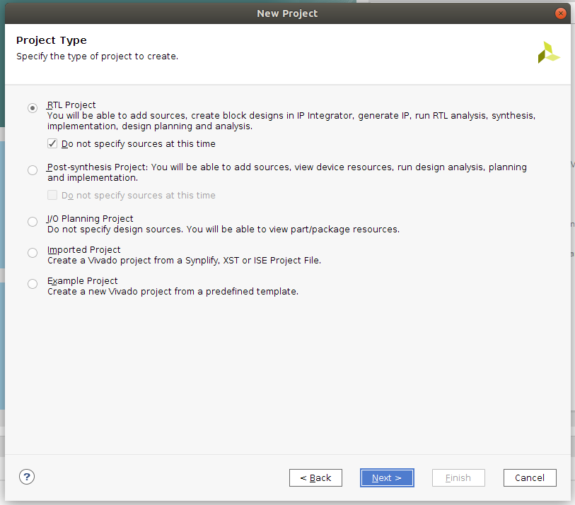
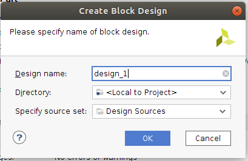
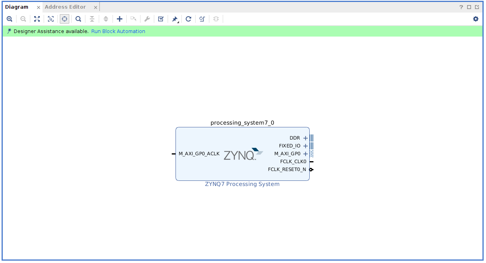
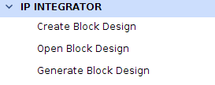
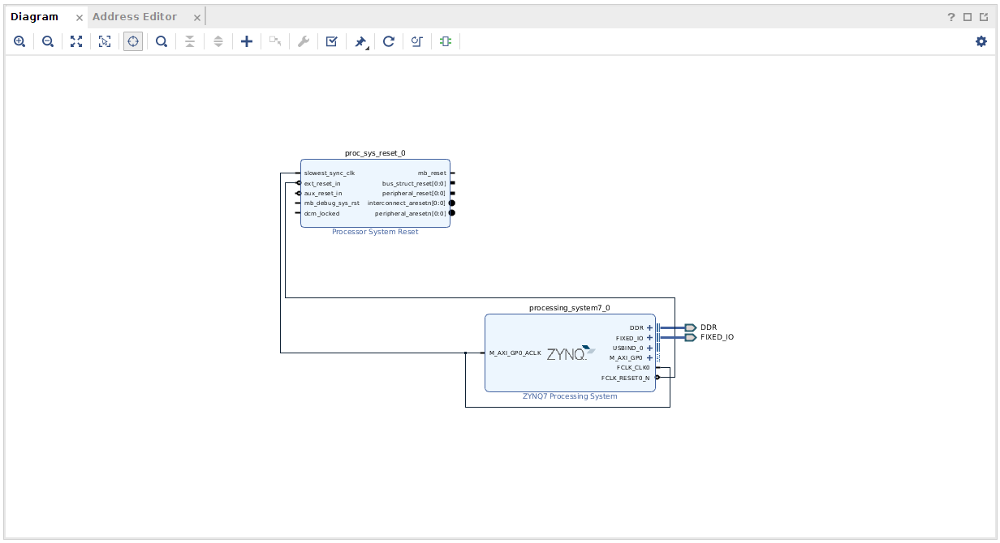

 

# Xilinx Vivado Setup

Created an HDL project in Xilinx Vivado to instantiate the Processing Unit and the Programable Logic Region.

### Vivado

1. Open Xilinx Vivado 2017.2 (whichever version is available in the lab)
2. Create an new Vivado Project

   

   1. Select **RTL Project** and **Do not specify sources at this time** and press **Next**

      

   2. Click on the **Boards** tab and scroll to find the **Zybo Z7-20**. Click **Next**. [Installing Boards](#Installing-Boards)

      

   3. Accept these options by pressing **Finish**

3. Create empty block design inside the new project
   1. Add the **ZYNQ7 Processing System** IP core and the **Processor System Reset** IP Core. Connect the *slowest_sync_clk* to the *M_AXI_GP0_ACLK* and the *FCLK_CLK0*. Also ensure that the *ext_reset_in* is connected to *FCLK_CLK0*. Run the **Block Automation**, accepting the default settings.

      

      - We do not need to add any additional cores as we are only using the processing system in this lab. In future labs we will look at how to communicate between the PS and PL.

      

   2. Validate, save and generate the block design

      

   3. Create an HDL system wrapper (Right click on the block diagram, which will be called "design_1.bd" if you didn't rename it, under **Sources->Design Sources**)

      

   4. Run Synthesis and Implementation to generate the netlist and floor planning

   5. You will now be prompted to generate Bitstream file, accept this option.
   6. Export Hardware Design (**File->Export->Export Hardware**) including the generated bitstream file to SDK tool
   7. Launch SDK (**File->Launch SDK**)

### Installing Boards

If required, you may need to install board files in order to support the Zybo Z7 FPGA board. The board files folder can be found here: C:\Xilinx\Vivado\2017.2\data\boards (Change the version for your specific version of Vivado). By default this folder contains XML files for different FPGA boards manufactured by Xilinx.

XML files define different interfaces on the board. Interfaces such as Slide Switches, Push Buttons, LEDs, USB-UART, DDR Memory, Ethernet etc.

Download and extract this Zip file from Digilent: https://github.com/Digilent/vivado-boards/archive/master.zip
You can also check out the repository for the board files on github located here

This zip file will contain a folder called new/board_files. Save this in your user documents folder. We will copy this board_files folder, navigate to the board_files folder inside the Vivado Installation directory, and merge them both.

1. Copy the contents of the board_files folder

2. Navigate to the board_files folder in the Vivado Installation directory (C:\Xilinx\Vivado\2015.1\data\boards\board_files)

3. Paste the contents into the board_files folder

4. Restart Vivado

The newly added files will each contain a sub-folder for the current board revision. This sub-folder contains the respective XML files for each FPGA board.

You are now ready to start a new IP Integrator based Vivado project for the Digilent Zybo Z7-20.