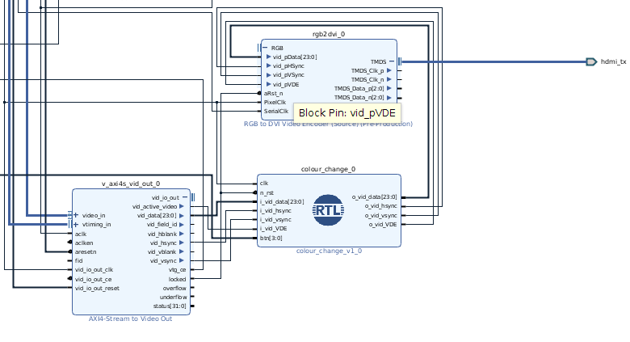

 

### **ES3F1 Lab 3**

Lab 3 makes use of the MIPI (CSI) camera interface on the Zybo Z7 20 board to demonstrate using hardware acceleration and prepare you for the assignment. We'll be using an example project from Digilent as a starting point for our block diagram as it gives us the basic routing for the physical interface required to talk to the camera. We'll then move onto looking at how we can modify this block diagram to add our own logic into the camera's datapath.

**Setup**

Navigate to the [Digilent PCAM-5C](https://github.com/Digilent/Zybo-Z7-20-pcam-5c/releases/tag/v2018.2-2) example repository and download the .ZIP file for the **2018.2** release.

Next extract this file to a known location on your H: drive, navigate to the `proj` folder and make a note of its location. Now open Vivado and click on the `TCL` console at the bottom of the welcome screen. Using the command `cd the_location_where_proj_is_saved` change the working directory of Vivado to this location. Now you can run the command `source ./create_project.tcl` which will generate the block diagram for the required hardware. *Note - If you are using Windows, you will need to replace the `\` in the path with `/` that you provide*

<!-- 
 

 -->

Add a new design source to the Vivado project, similar to how we added Verilog source files in ES3B2. Use the file (in the rtl directory) called [colour_change.v](rtl/colour_change.v). This files contains a simple example for how to change the RGB data stream and pass through the Hsync and Vsync signals to the required outputs. Now right click the Verilog file and click `Add Modules to Design`. This will place your module into the block diagram such that you can connect it to other ip modules. Locate the `AXI4-Stream to Video Out` and the `RGB to DVI Encoder (Source)` modules. Delete the connection that joins the `vid_io_out` and `RBG` buses; this is where out IP will be placed.

<!-- 
 

 -->

Now expand the `vid_io_out` bus and connect the `vid_active_video` to the `i_vid_VDE` port. Do the same for `vid_data`, `vid_hsync` and `vid_vsync` to their respective ports on the `colour_change` module. Then connect the outputs from the `colour_change` module to the `RGB to DVI Video Encoder (Source)`. The final step is to right click the `btn` port and make it external. This allows us to connect it to the button in the constraints file.

Under design sources, open the `ZyboZ7_A.xdc` file and uncomment the `btn[0]` port. Ensure that the name of this port (in the .xdc file) matches the name of the port that was made external in the block diagram. 

Now click `Generate Block Design`, followed by `Generate Bitstream` this will prompt you to both run synthesis and implementation before generating the bitstream. Click ok to the options and wait for the design run to finish. After the run has completed, navigate to `File -> Export -> Export Hardware` making sure to tick the box that reads `Include Bitstream`. Accept the option that states the export location as `local to project`. After this has run, go to `File -> Launch SDK`. This will load the generated board's BSP and other supplementary files.

Now that you are in the SDK, navigate to `File -> Import...`. Click the dropdown for `General` and choose `Existing Projects into Workspace`. Select the directory where you first unzipped the folders you downloaded and navigate to the `sdk` folder. Press OK and ensure that all the projects are selected. **Ensure that you click `Copy projects into workspace` before pressing finish**.

Now that the projects have been added to the workspace, you might need to rebuild them in order to correctly point them at the generated BSP file. If this still causes errors, try exporting your hardware from Vivado again. This action should force the SDK to retarget the BSP.

Connect the Pcam-5C camera module to the Zybo (do not turn on the board before doing this!).You will now need to flash the bitstream to your Zybo (You should make sure your Zybo is connected at this point). 

Now you can run the project on your Zybo the same as in previous labs; program the FPGA, right click on the `pcam_vdma_hdmi` project and select `Run As -> Launch on Hardware` this will launch the SDK log and show you the project build log. If you now connect the Zybo's HDMI TX port to your monitor/screen, you should see the output from the camera. Press `BTN0` to swap the colour space and note what changes in the video feed. Additionally, if you connect the SDK serial terminal, you will be given some additional options for changing the settings of the camera.

You should now have a working project which you can use to start your assignment.

### **Objectives**

1. Take a look at the `pcam_vdma_hdmi` project within the SDK. Understand what the C++ code is doing and consider how you might take advantage of the processing system in your assignment.
2. Think about how you might be able to perform operations on the stream of RBG values being output by the Camera. What needs to be preserved and how could you deal with looking at surrounding pixels, i.e. how you might do edge detection?
3. Consider how you could communicate with the overlay ip core via the PS. Think about using AXI Lite to control registers or even using the DMA controller to send images to superimpose on the video stream.

*Note - if any of these set up instructions are unclear, please see the generic digilent project [setup guide](https://reference.digilentinc.com/learn/programmable-logic/tutorials/github-demos/start)*
 
